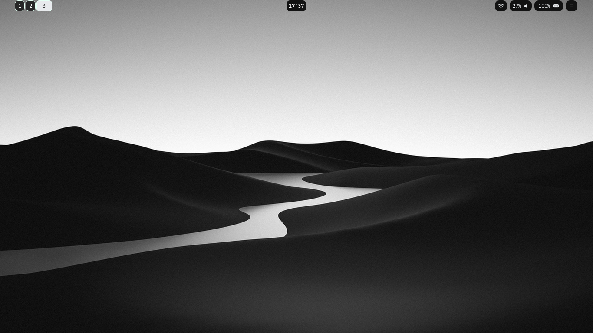

# dotfiles

My personal Linux desktop configuration based on **SwayWM**, built and tested on **CachyOS** (Arch-based).

A minimal setup for daily use or as a base for customization




## Required Packages

### Core

- sway
- waybar
- kitty
- alacritty
- rofi
- swaylock-effects
- swayidle
- swaync
- wlogout
- fastfetch

### Wayland

- xdg-desktop-portal
- xdg-desktop-portal-wlr
- wl-clipboard
- grim
- slurp

### Networking

- networkmanager
- networkmanager-dmenu

### Utilities

- awww (wallpaper daemon, `awww` + `awww-daemon`)
- cliphist
- playerctl
- brightnessctl
- pipewire
- wireplumber
- nautilus (default file manager, bound to `Alt+E`)
- neovim (optional)

### Fonts & Theme

- ttf-jetbrains-mono-nerd
- noto-fonts
- noto-fonts-emoji
- bibata-cursor-theme (`Bibata-Modern-Ice`, set in `sway/config`)

> **Note:** `fish/config.fish` sources `cachyos-fish-config`, which only exists on CachyOS.
> On other distros, remove/replace that line or your Fish shell won't start.

## Components

| Component | Software |
|---|---|
| Window Manager | Sway |
| Status Bar | Waybar |
| Application Launcher | Rofi |
| Terminal | Kitty (default), Alacritty (alt config) |
| Lock Screen | Swaylock |
| Idle Management | Swayidle |
| Notifications | Swaync |
| Logout Menu | Wlogout |
| Wallpaper Daemon | awww |
| System Info | Fastfetch |

## Repository Structure

```text
.
├── .config/
│   ├── alacritty/               # Alacritty terminal
│   ├── fastfetch/               # Fastfetch configuration
│   ├── kitty/                   # Kitty terminal
│   ├── networkmanager-dmenu/    # NetworkManager dmenu config
│   ├── rofi/                    # Rofi themes & helper scripts
│   ├── sway/                    # Sway configuration & scripts
│   ├── swaylock/                # Swaylock configuration
│   ├── waybar/                  # Waybar configuration & scripts
│   └── wlogout/                 # Wlogout layout & styling
├── Pictures/
│   ├── screenshots/             # Screenshots used in this README
│   └── wallpapers/              # Wallpapers used by the wallpaper picker
├── install.sh                   # Automated installation script
├── README.md
└── LICENSE
```

## Keybindings

`$mod` = `Super` (Mod4) · `$alt` = `Alt` (Mod1)

### Apps & Launchers

| Keybind | Action |
|---|---|
| `Mod + Return` | Open terminal (kitty) |
| `Alt + Space` | App launcher (rofi drun) |
| `Alt + E` | Open file manager (nautilus) |
| `Alt + V` | Clipboard history (cliphist + rofi) |
| `Alt + C` | Edit config (sway / waybar / alacritty via rofi + nvim) |
| `Alt + W` | Wallpaper picker |
| `Alt + Shift + Space` | Window switcher (rofi) |

### Window Management

| Keybind | Action |
|---|---|
| `Mod + Q` | Kill focused window |
| `Mod + H/J/K/L` or Arrow keys | Move focus (left/up/down/right) |
| `Alt + Tab` / `Alt + Shift + Tab` | Cycle focus right / left |
| `Mod + Shift + H/J/K/L` or `Shift + Arrows` | Move window |
| `Mod + B` | Split horizontal |
| `Mod + V` | Split vertical |
| `Mod + S` | Stacking layout |
| `Mod + W` | Tabbed layout |
| `Mod + E` | Toggle split layout |
| `Mod + F` | Fullscreen |
| `Mod + Shift + Space` | Toggle floating |
| `Mod + Space` | Toggle focus mode (tiling/floating) |
| `Mod + A` | Focus parent container |
| `Mod + R` | Resize mode (arrows/hjkl to resize, `Esc`/`Return` to exit) |
| `Mod + Minus` | Show scratchpad |
| `Mod + Shift + Minus` | Move window to scratchpad |

### Workspaces

| Keybind | Action |
|---|---|
| `Mod + 1..0` | Switch to workspace 1–10 |
| `Mod + Shift + 1..0` | Move focused window to workspace 1–10 |

### System

| Keybind | Action |
|---|---|
| `Mod + Shift + C` | Reload sway config |
| `Mod + Shift + E` | Toggle wlogout menu |
| `Mod + Alt + L` | Lock screen (swaylock) |
| `Print` | Screenshot selection (grim + slurp → clipboard + file) |
| `Shift + Print` | Screenshot fullscreen (→ clipboard + file) |

### Media & Hardware Keys

| Keybind | Action |
|---|---|
| `XF86AudioMute` | Toggle mute |
| `XF86AudioLowerVolume` / `RaiseVolume` | Volume down / up (2%) |
| `XF86AudioMicMute` | Toggle mic mute |
| `XF86AudioPlay` / `Pause` | Play / pause media |
| `XF86AudioNext` / `Prev` | Next / previous track |
| `XF86AudioStop` | Stop media |
| `XF86MonBrightnessDown` / `Up` | Brightness down / up (2%) |

## Installation

Clone the repository:

```bash
git clone https://github.com/TemLing/dotfiles.git
```

### Install dependencies

Install all packages listed in **Required Packages**.

On Arch-based distributions:

```bash
sudo pacman -S stow
```

### Deploy with GNU Stow (Recommended)

Create symbolic links into your home directory:

```bash
cd dotfiles
stow --target="$HOME" .
```

This will create links such as:

```text
~/.config/sway        -> dotfiles/.config/sway
~/.config/waybar      -> dotfiles/.config/waybar
~/Pictures/wallpapers -> dotfiles/Pictures/wallpapers
```

Whenever you update the repository:

```bash
git pull
stow --restow --target="$HOME" .
```

To remove every symlink created by Stow:

```bash
stow -D --target="$HOME" .
```

### Automated installation

An installation script is also provided:

```bash
chmod +x install.sh
./install.sh
```

The script installs required packages (Arch/CachyOS) and deploys the dotfiles using GNU Stow.

### Manual installation

If you don't want to use Stow, copy the files manually:

```bash
mkdir -p ~/.config ~/Pictures
cp -r .config/* ~/.config/
cp -r Pictures/* ~/Pictures/
```

Log out and back in (or reload Sway with `Mod + Shift + C`) after installation.

## Wallpapers

Wallpaper images are in `wallpapers/`. The wallpaper picker (`Alt + W`) reads from
`~/Pictures/Wallpaper` by default — copy the images there, or edit `WALLPAPER_DIR` in
`sway/scripts/wallpaper-changer.sh` to point at this repo's `wallpapers/` folder instead.

## License

This project is licensed under the MIT License.

See the [LICENSE](LICENSE) file for details.
